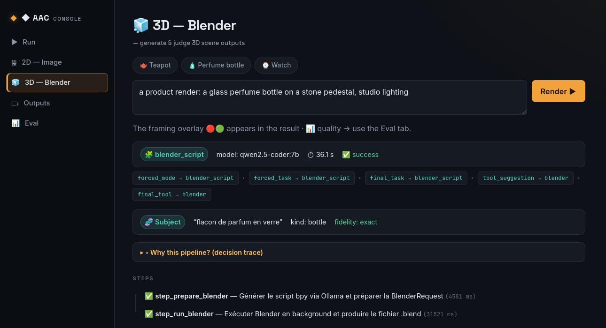
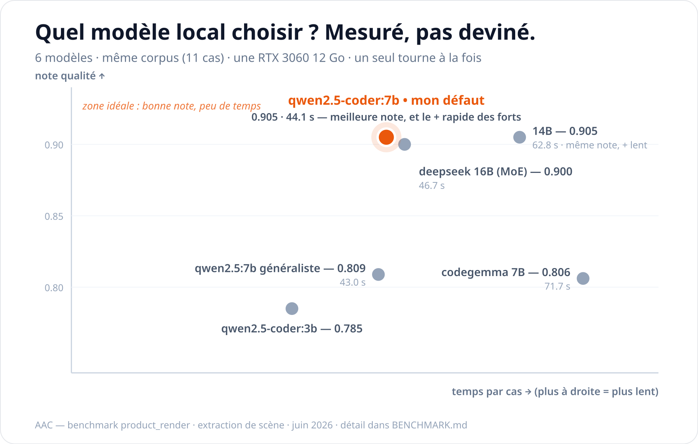

<div align="center">

# AAC — AI Assistant Core
### Local-first AI orchestration for 3D-production studios.
*Decide. Secure. Self-correct. Prove. — every step, on your own hardware.*

[](https://github.com/BNHR-dev/AI_ASSISTANT_CORE/actions/workflows/tests.yml) [](LICENSE)  



</div>

AAC turns a natural-language request into a **structured routing decision**, an **explicit execution plan**, and a **step-by-step run** across local models and creative tools — and returns a result you can trace end to end.

It is **not a thin wrapper around a chat model.** The core is a real orchestration loop — **router → planner → executor** — with an observability layer on top, running entirely on your own hardware.

> **Status — honest by default.** The core — routing, planning, execution, OpenAI-compatible API — is stable and test-covered. The Blender pipeline is experimental but functional, and its LLM quality is **measured, not asserted**: a reproducible, multi-model baseline lives in [`BENCHMARK.md`](BENCHMARK.md). Limitations are stated plainly in the [Roadmap](#roadmap) — nothing here is oversold.

## Why AAC

**Built for 3D-production studios** — where the material is confidential by default (unreleased films, client assets, work under NDA and content-security regimes), and *"it generates"* is not enough: the pipeline has to be controllable, auditable, and trustworthy.

- **Local-first.** LLM, vision, and image/3D generation all run on your hardware. The only outbound path is an optional web search — confidential assets never leave the host.
- **Generated code is treated as untrusted.** AAC writes and runs code on your behalf and never gives it a free hand — constrained at the source, re-read before execution, and sandboxed. *(How → [How it works](#how-it-works) · isolation → [Security](#security).)*
- **Quality is measured, not asserted.** A reproducible, multi-model benchmark backs the model choices — not vibes. *(See [`BENCHMARK.md`](BENCHMARK.md).)*
- **3D-native, not throwaway 2D.** The bet: AI that builds *real* 3D — geometry, materials, cameras — editable, consistent, pipeline-ready, where flat AI images can't be revised or art-directed. 2D is there for fast exploration; **3D is where the lasting value is.**
- **A real orchestrator, not a chatbot.** Router → planner → executor, every decision traceable and replayable.

## Quickstart — one command

**The only thing you install is [Docker](https://docs.docker.com/get-docker/)** (with the Compose v2 plugin). No Python, no models, no manual setup — the launcher fetches and builds everything.

```bash
git clone https://github.com/BNHR-dev/AI_ASSISTANT_CORE.git aac
cd aac
./run.sh          # Linux / WSL2 / macOS   —   Windows: run.bat (Docker Desktop + WSL2)
```

`run.sh` writes the SearXNG config, downloads the models (~20 GB on first run), builds the images, brings up the **hardened** stack, and verifies every service is *actually* healthy before opening the Console. NVIDIA GPU is auto-detected (CPU fallback otherwise).

When you see `== OK — stack ready ==`, open **<http://127.0.0.1:8000/console>** and try a prompt, an image, or *"create a Blender scene with a cube"* (3D → `scene.blend` + `preview.png`). Stop with `./run.sh --down`.

> Validated end to end from a **bare clone with only Docker installed** — models downloaded, images built, hardened stack healthy, a real Blender render — nothing pre-staged.

**Pick your effort level:**

| Effort | You run | Needs |
|---|---|---|
| Just watch | a hosted demo video *(coming soon)* | a browser |
| **One command** (recommended) | `./run.sh` | Docker (+ NVIDIA toolkit for GPU) |
| Native | the production runtime | Linux + GPU |

**Other ways to run**
- **Native (dev):** `docker compose -f docker/docker-compose.linux.yml up -d`, backend on `127.0.0.1:8000`. → [`docs/SETUP_LINUX.md`](docs/SETUP_LINUX.md) · [`docs/SETUP_WINDOWS.md`](docs/SETUP_WINDOWS.md)
- **Models only / preflight:** `cd core && make deps` (download models) · `make doctor` (checks what's missing).
- **Virgin Windows, no Docker:** `core\scripts\windows\Install-AAC.bat` installs everything natively (Ollama, Blender, ComfyUI, venv).

GPU prerequisites, the hardened-container model, per-run output layout → [`docs/DOCKER.md`](docs/DOCKER.md) · [`core/docs/DEPENDENCIES.md`](core/docs/DEPENDENCIES.md).

## How it works

One readable path from request to output:

```
task_classifier → routing → tool_selector → planner → step_executor → result_assembler
```

- **Router** — classifies the request, then selects an agent, a model, and a tool when one is needed.
- **Planner** — turns that decision into an explicit, inspectable plan.
- **Executor** — runs the plan step by step and assembles the final output.
- **Observability** — every run exposes enough trace to replay the decision after the fact.

Execution strategies are explicit, not implicit:

| Strategy | For |
|---|---|
| `single_step` | direct answers, simple build |
| `two_step_llm` | explain-then-refine |
| `web_pipeline` | SearXNG search + LLM synthesis |
| `visual_pipeline` | prompt-intent analysis → ComfyUI |
| `blender_pipeline` | natural language → `bpy` → headless Blender |

### What makes the 3D pipeline trustworthy
The Blender path is where AI writes code — so it's built to be controlled, not trusted blindly:
- **Constrained generation.** For product renders, the AI fills a *validated spec* (bounded shapes, materials, colors); a deterministic builder turns it into Blender code — the AI never has a free hand on the code. *(Sandbox & isolation → [Security](#security).)*
- **Deterministic self-correction.** If a render misses its contract — missing lights, bad framing, a stray object — a single deterministic pass repairs the scene and re-renders. No AI retry loop; predictable every time.
- **Framing verified by geometry.** The subject's place in frame is computed by projecting it through the camera, then cross-checked against the actual rendered pixels — not judged by eye.
- **Every run is evidence.** A manifest, a model-call log, a pass/fail scene report and a framing overlay make each run auditable and replayable.

## What it does

**Reason & build (text)** — explanation (plain or advanced), code-oriented builds, critique, architecture.
**Create (visual)** — experimental 3D scenes via Blender (natural language → `bpy` → a canonical `scene.blend` + best-effort `preview.png`); 2D images via ComfyUI, with subject / render-intent / style analysis driving workflow selection.
**Research & see** — private web research (SearXNG + LLM synthesis); vision through a local VLM (`qwen2.5vl`).
**Integrate** — OpenAI-compatible API; drops straight into Open-WebUI and other OpenAI clients.

## Stack — everything on `127.0.0.1`

| Service | Role |
|---|---|
| FastAPI | the orchestrator + API |
| Ollama | local LLM inference |
| Blender (headless) | 3D scene generation |
| ComfyUI | 2D image generation |
| SearXNG | private web search |

Single-host and GPU-accelerated (developed on an RTX 3060). Runs on **Linux** (Fedora, validated) and **Windows** (Docker Desktop).

## Security

Generated code is the thing AAC trusts least. The Blender pipeline writes and runs `bpy` code, and that code is confined at the OS level — by default, and you can make it mandatory.

- **Docker (recommended, cross-platform incl. Windows/WSL2).** The hardened container *is* the confinement boundary: `cap_drop: ALL`, `no-new-privileges`, read-only rootfs, no extra privileges. Here Docker's confinement *replaces* bubblewrap rather than running it.
- **Native Linux.** Generated code runs under [bubblewrap](https://github.com/containers/bubblewrap): no network, no home, read-only system, writes restricted to a single output directory. Can be made mandatory (`AAC_BLENDER_SANDBOX=require`, fail-closed).
- **Scope, stated honestly.** Only the LLM-generated Blender code is treated as hostile; ComfyUI runs fixed, user-authored workflows. Stronger isolation is on the [Roadmap](#roadmap), not yet shipped.

Full model, the rootless-Podman path (bubblewrap without `SYS_ADMIN`, proven but not yet wired) and the threat model → [`SECURITY.md`](SECURITY.md).

## Benchmark — measured, not asserted

Most solo projects say *"it works."* AAC **measures** it. Two reproducible eval harnesses score the LLM's output on a fixed, versioned corpus — one for generated code, one for the product render — and the same 11 cases run across **six models**, so the default is chosen on evidence, not taste.



| Model | Quality | Time (11 cases) |
|---|---|---|
| **`qwen2.5-coder:7b`** *(default)* | **0.987** | **34.4 s** |
| `qwen2.5-coder:14b` | 0.951 | 56.9 s |
| `qwen2.5:7b` *(generalist)* | 0.931 | 40.0 s |
| `qwen2.5-coder:3b` | 0.862 | 29.2 s |
| `codegemma:7b` | 0.828 | 67.3 s |
| `deepseek-coder-v2:16b` | 0.822 | 48.9 s |

The default (`coder:7b`) is **the best quality outright — and the fastest of the strong models** (1.65× faster than the runner-up) on consumer hardware. The benchmark keeps earning its keep: its per-field breakdown exposed a spec-level weakness (`schema_version`, weak for *every* model), one extraction-prompt fix later that field scores 1.000 — and re-running the six-model comparison showed the rankings reshuffle with the prompt, proof that a benchmark measures the **model × prompt pair**, not the model alone.

**Honest scope:** small corpora (5 and 11 cases), only the Blender-side LLM is measured yet, and the pinned greedy decoding makes this a *reproducibility* baseline, not a robustness one. Full method, per-field scores and the cross-seed consolidation → [`BENCHMARK.md`](BENCHMARK.md).

## API

OpenAI-compatible — drops straight into Open-WebUI and other OpenAI clients:

```bash
curl -sN http://127.0.0.1:8000/v1/chat/completions \
  -H 'Content-Type: application/json' \
  -d '{"model":"assistant-core-image","messages":[{"role":"user",
       "content":"a tranquil japanese zen garden at dawn, cinematic"}]}'
```

- `GET /v1/models` · `POST /v1/chat/completions` — OpenAI-compatible (`content` is always a string)
- `POST /route` — inspect the routing decision for a request
- `POST /execute` — run the full pipeline
- `GET /health` · `GET /health/runtime` · `GET /debug/canonical`

## Roadmap

**Where this is going** — the bet is *grounded* 3D-native generation, and it is no longer a lone bet: **world models** are pushing AI toward real 3D understanding. Yann LeCun left Meta and raised $1B to build them (AMI Labs); World Labs' Marble already exports generated worlds as meshes and Gaussian splats. None of them ship **production discipline** — contracts, verification, traceability. That layer is what AAC builds. The AI fills validated specs today; next is retrieval-augmented grounding (**RAG**) over a studio's own assets and conventions, so native-3D output stays correct and consistent at production scale. And when generated worlds reach the pipeline, they get treated like everything else here: **untrusted input, put under contract**. AI that *assists* the 3D pipeline rather than replacing it with flat images.

Near-term, concrete:
- **Stronger isolation.** Generated `bpy` code already runs OS-confined (bubblewrap / hardened container). Next: a dedicated VM, ComfyUI confinement, and CPU/RAM quotas — so untrusted code can never touch confidential assets or exhaust the host. A goal, not a shipped guarantee.
- **Wider measurement.** Extend the benchmark beyond the Blender LLM — the router, the web path, ComfyUI — and add true cross-seed robustness (`temperature > 0`).
- **Richer 3D.** More Blender templates (materials, lighting, composition), multi-object scenes, and animation workflows.

## License

Copyright (c) 2026 BNHR-dev — [AGPL-3.0](LICENSE). Derivatives, including networked/SaaS use, must stay open. Commercial licensing available from the author.
